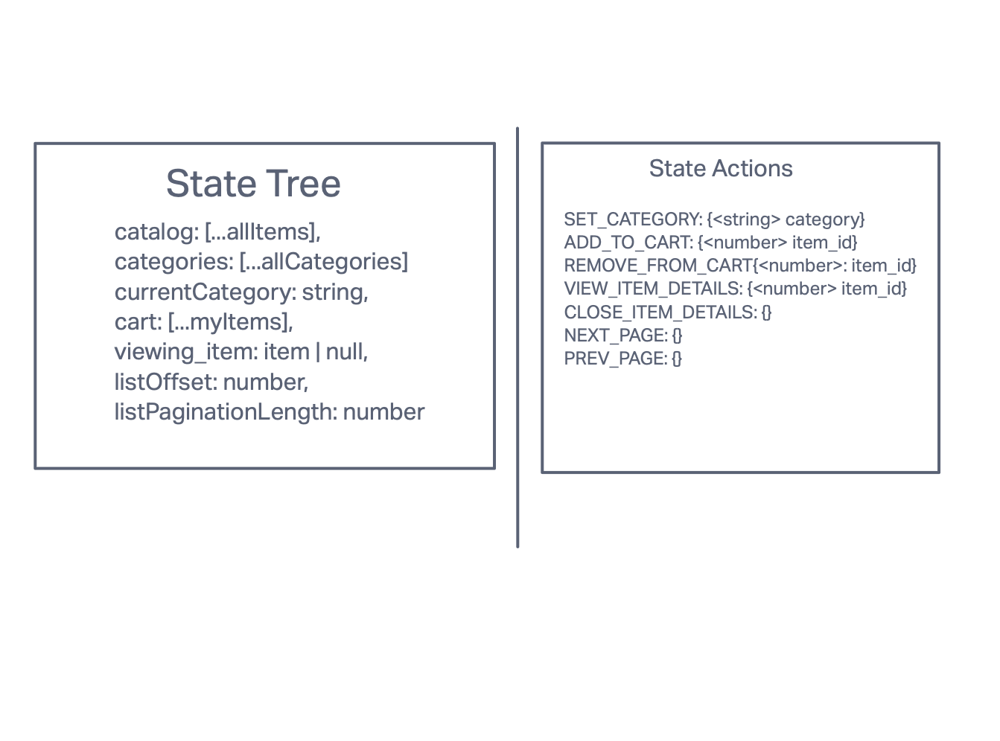

# Redux Storefront

This is a basic storefront app the demonstrates the use of redux in a react app. The functionality is details in the diagrams below.

### Diagram

## Contributing and setup

### Steps to run as a developer

Clone the app from github

    git clone https://github.com/rmccrear/36-redux-storefront.git

Install dependencies

    npm install

Run the app

    npm start
